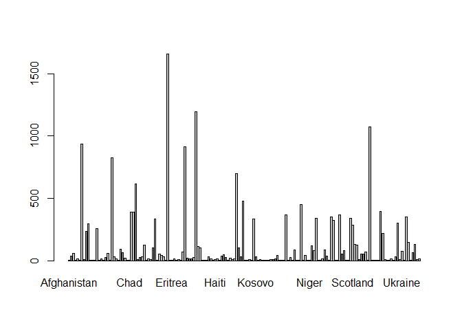
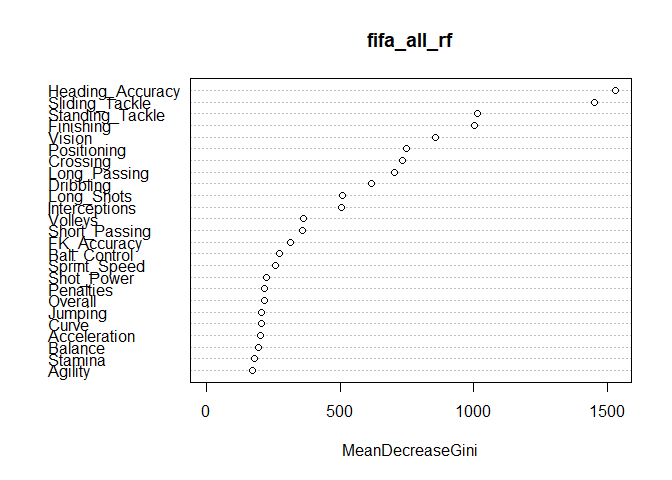
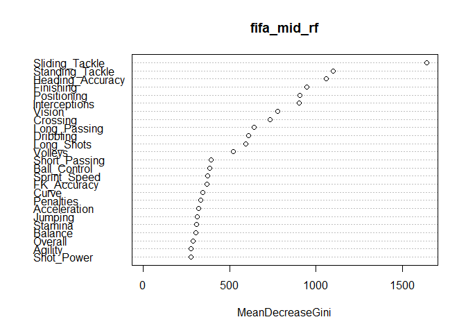

Discriminant Analysis and Random Forest Using FIFA 19 Data
================
Travis Gubbe
Revised: May 17, 2023

In this project, data from the FIFA 19 video game will used to
demonstrate discriminant analysis and random forest. Originally, this
project was part of a final project in my last semester of college. My
job was clean the data and perform the discriminant analysis and random
forest. All other parts of the project have been excluded. The FIFA data
contains over 50 variables, as well as over 18,000 entries.

The original data set is no longer available. However, a similar data
set can be found at:

<https://www.kaggle.com/datasets/chaitanyahivlekar/fifa-19-player-dataset>

## Import the Dataset

The FIFA 19 data is read into R Markdown. In addition, a subset is
created to condense the amount of variables.

``` r
data = read.csv('~/R datasets/fifa_data.csv')

fifa = subset(data, select = c(ID, Name, Age, Nationality, Overall, Potential, Club, Value,
                                Wage, Preferred.Foot, International.Reputation, Weak.Foot,
                                Skill.Moves, Position, Contract.Valid.Until, Height, Weight,
                                Crossing, Finishing, HeadingAccuracy, ShortPassing, Volleys,
                                Dribbling, Curve, FKAccuracy, LongPassing, BallControl, 
                                Acceleration, SprintSpeed, Agility, Reactions, Balance, 
                                ShotPower,Jumping, Stamina, Strength, LongShots, 
                                Aggression, Interceptions,Positioning, Vision, 
                                Penalties, Composure, Marking,StandingTackle, 
                                SlidingTackle, GKDiving, GKHandling, GKKicking,
                                GKPositioning, GKReflexes, Release.Clause))
names(fifa)
```

    ##  [1] "ID"                       "Name"                    
    ##  [3] "Age"                      "Nationality"             
    ##  [5] "Overall"                  "Potential"               
    ##  [7] "Club"                     "Value"                   
    ##  [9] "Wage"                     "Preferred.Foot"          
    ## [11] "International.Reputation" "Weak.Foot"               
    ## [13] "Skill.Moves"              "Position"                
    ## [15] "Contract.Valid.Until"     "Height"                  
    ## [17] "Weight"                   "Crossing"                
    ## [19] "Finishing"                "HeadingAccuracy"         
    ## [21] "ShortPassing"             "Volleys"                 
    ## [23] "Dribbling"                "Curve"                   
    ## [25] "FKAccuracy"               "LongPassing"             
    ## [27] "BallControl"              "Acceleration"            
    ## [29] "SprintSpeed"              "Agility"                 
    ## [31] "Reactions"                "Balance"                 
    ## [33] "ShotPower"                "Jumping"                 
    ## [35] "Stamina"                  "Strength"                
    ## [37] "LongShots"                "Aggression"              
    ## [39] "Interceptions"            "Positioning"             
    ## [41] "Vision"                   "Penalties"               
    ## [43] "Composure"                "Marking"                 
    ## [45] "StandingTackle"           "SlidingTackle"           
    ## [47] "GKDiving"                 "GKHandling"              
    ## [49] "GKKicking"                "GKPositioning"           
    ## [51] "GKReflexes"               "Release.Clause"

## Exploring the Data

First, the data was explored to understand the patterns and
relationships of the data. Exploring the data allows us to see what type
of analysis can be run.

### Cleaning Data

Before beginning the analysis, the data is inspected for incomplete (NA)
values. The column names are also changed to more user-friendly titles.
The stringr package is used to remove the letters from integer
variables.

``` r
#See if there are any NA values in the dataset
na_values_count <- colSums(is.na(fifa))
na_values_count
```

    ##                       ID                     Name                      Age 
    ##                        0                        0                        0 
    ##              Nationality                  Overall                Potential 
    ##                        0                        0                        0 
    ##                     Club                    Value                     Wage 
    ##                        0                      240                      229 
    ##           Preferred.Foot International.Reputation                Weak.Foot 
    ##                        0                        0                        0 
    ##              Skill.Moves                 Position     Contract.Valid.Until 
    ##                        0                        0                        0 
    ##                   Height                   Weight                 Crossing 
    ##                        0                        0                        0 
    ##                Finishing          HeadingAccuracy             ShortPassing 
    ##                        0                        0                        0 
    ##                  Volleys                Dribbling                    Curve 
    ##                        0                        0                        0 
    ##               FKAccuracy              LongPassing              BallControl 
    ##                        0                        0                        0 
    ##             Acceleration              SprintSpeed                  Agility 
    ##                        0                        0                        0 
    ##                Reactions                  Balance                ShotPower 
    ##                        0                        0                        0 
    ##                  Jumping                  Stamina                 Strength 
    ##                        0                        0                        0 
    ##                LongShots               Aggression            Interceptions 
    ##                        0                        0                        0 
    ##              Positioning                   Vision                Penalties 
    ##                        0                        0                        0 
    ##                Composure                  Marking           StandingTackle 
    ##                        0                        0                        0 
    ##            SlidingTackle                 GKDiving               GKHandling 
    ##                        0                        0                        0 
    ##                GKKicking            GKPositioning               GKReflexes 
    ##                        0                        0                        0 
    ##           Release.Clause 
    ##                     1504

``` r
#View the classes of the variables
sapply(fifa, class)
```

    ##                       ID                     Name                      Age 
    ##                "integer"              "character"                "integer" 
    ##              Nationality                  Overall                Potential 
    ##              "character"                "integer"                "integer" 
    ##                     Club                    Value                     Wage 
    ##              "character"              "character"              "character" 
    ##           Preferred.Foot International.Reputation                Weak.Foot 
    ##              "character"                "integer"                "integer" 
    ##              Skill.Moves                 Position     Contract.Valid.Until 
    ##                "integer"              "character"              "character" 
    ##                   Height                   Weight                 Crossing 
    ##              "character"                "integer"                "integer" 
    ##                Finishing          HeadingAccuracy             ShortPassing 
    ##                "integer"                "integer"                "integer" 
    ##                  Volleys                Dribbling                    Curve 
    ##                "integer"                "integer"                "integer" 
    ##               FKAccuracy              LongPassing              BallControl 
    ##                "integer"                "integer"                "integer" 
    ##             Acceleration              SprintSpeed                  Agility 
    ##                "integer"                "integer"                "integer" 
    ##                Reactions                  Balance                ShotPower 
    ##                "integer"                "integer"                "integer" 
    ##                  Jumping                  Stamina                 Strength 
    ##                "integer"                "integer"                "integer" 
    ##                LongShots               Aggression            Interceptions 
    ##                "integer"                "integer"                "integer" 
    ##              Positioning                   Vision                Penalties 
    ##                "integer"                "integer"                "integer" 
    ##                Composure                  Marking           StandingTackle 
    ##                "integer"                "integer"                "integer" 
    ##            SlidingTackle                 GKDiving               GKHandling 
    ##                "integer"                "integer"                "integer" 
    ##                GKKicking            GKPositioning               GKReflexes 
    ##                "integer"                "integer"                "integer" 
    ##           Release.Clause 
    ##              "character"

``` r
colnames(fifa)[colnames(fifa) == "Wage"] <- "Wage_Thousands"
colnames(fifa)[colnames(fifa) == "Value"] <- "Value_Millions"
colnames(fifa)[colnames(fifa) == "Preferred.Foot"] <- "Preferred_Foot"
colnames(fifa)[colnames(fifa) == "International.Reputation"] <- "International_Reputation"
colnames(fifa)[colnames(fifa) == "Weak.Foot"] <- "Weak_Foot"
colnames(fifa)[colnames(fifa) == "Skill.Moves"] <- "Skill_Moves"
colnames(fifa)[colnames(fifa) == "Contract.Valid.Until"] <- "Contract_Valid_Until"
colnames(fifa)[colnames(fifa) == "HeadingAccuracy"] <- "Heading_Accuracy"
colnames(fifa)[colnames(fifa) == "ShortPassing"] <- "Short_Passing"
colnames(fifa)[colnames(fifa) == "FKAccuracy"] <- "FK_Accuracy"
colnames(fifa)[colnames(fifa) == "LongPassing"] <- "Long_Passing"
colnames(fifa)[colnames(fifa) == "BallControl"] <- "Ball_Control"
colnames(fifa)[colnames(fifa) == "SprintSpeed"] <- "Sprint_Speed"
colnames(fifa)[colnames(fifa) == "ShotPower"] <- "Shot_Power"
colnames(fifa)[colnames(fifa) == "LongShots"] <- "Long_Shots"
colnames(fifa)[colnames(fifa) == "StandingTackle"] <- "Standing_Tackle"
colnames(fifa)[colnames(fifa) == "SlidingTackle"] <- "Sliding_Tackle"
colnames(fifa)[colnames(fifa) == "GKDiving"] <- "GK_Diving"
colnames(fifa)[colnames(fifa) == "GKHandling"] <- "GK_Handling"
colnames(fifa)[colnames(fifa) == "GKKicking"] <- "GK_Kicking"
colnames(fifa)[colnames(fifa) == "GKPositioning"] <- "GK_Positioning"
colnames(fifa)[colnames(fifa) == "GKReflexes"] <- "GK_Reflexes"
colnames(fifa)[colnames(fifa) == "Release.Clause"] <- "Release_Clause_Millions"

names(fifa)
```

    ##  [1] "ID"                       "Name"                    
    ##  [3] "Age"                      "Nationality"             
    ##  [5] "Overall"                  "Potential"               
    ##  [7] "Club"                     "Value_Millions"          
    ##  [9] "Wage_Thousands"           "Preferred_Foot"          
    ## [11] "International_Reputation" "Weak_Foot"               
    ## [13] "Skill_Moves"              "Position"                
    ## [15] "Contract_Valid_Until"     "Height"                  
    ## [17] "Weight"                   "Crossing"                
    ## [19] "Finishing"                "Heading_Accuracy"        
    ## [21] "Short_Passing"            "Volleys"                 
    ## [23] "Dribbling"                "Curve"                   
    ## [25] "FK_Accuracy"              "Long_Passing"            
    ## [27] "Ball_Control"             "Acceleration"            
    ## [29] "Sprint_Speed"             "Agility"                 
    ## [31] "Reactions"                "Balance"                 
    ## [33] "Shot_Power"               "Jumping"                 
    ## [35] "Stamina"                  "Strength"                
    ## [37] "Long_Shots"               "Aggression"              
    ## [39] "Interceptions"            "Positioning"             
    ## [41] "Vision"                   "Penalties"               
    ## [43] "Composure"                "Marking"                 
    ## [45] "Standing_Tackle"          "Sliding_Tackle"          
    ## [47] "GK_Diving"                "GK_Handling"             
    ## [49] "GK_Kicking"               "GK_Positioning"          
    ## [51] "GK_Reflexes"              "Release_Clause_Millions"

``` r
#Uses string remove function in stringr to remove the letters from the given variables.
fifa$Value_Millions = str_remove(fifa$Value_Millions, '[M]')
fifa$Release_Clause_Millions = str_remove(fifa$Release_Clause_Millions, '[M]')
fifa$Wage_Thousands = str_remove(fifa$Wage_Thousands, '[K]')

head(fifa)
```

    ##       ID              Name Age Nationality Overall Potential
    ## 1 158023          L. Messi  31   Argentina      94        94
    ## 2  20801 Cristiano Ronaldo  33    Portugal      94        94
    ## 3 190871         Neymar Jr  26      Brazil      92        93
    ## 4 193080            De Gea  27       Spain      91        93
    ## 5 192985      K. De Bruyne  27     Belgium      91        92
    ## 6 183277         E. Hazard  27     Belgium      91        91
    ##                  Club Value_Millions Wage_Thousands Preferred_Foot
    ## 1        FC Barcelona          110.5            565           Left
    ## 2            Juventus             77            405          Right
    ## 3 Paris Saint-Germain          118.5            290          Right
    ## 4   Manchester United             72            260          Right
    ## 5     Manchester City            102            355          Right
    ## 6             Chelsea             93            340          Right
    ##   International_Reputation Weak_Foot Skill_Moves Position Contract_Valid_Until
    ## 1                        5         4           4       RF                 2021
    ## 2                        5         4           5       ST                 2022
    ## 3                        5         5           5       LW                 2022
    ## 4                        4         3           1       GK                 2020
    ## 5                        4         5           4      RCM                 2023
    ## 6                        4         4           4       LF                 2020
    ##   Height Weight Crossing Finishing Heading_Accuracy Short_Passing Volleys
    ## 1    5'7    159       84        95               70            90      86
    ## 2    6'2    183       84        94               89            81      87
    ## 3    5'9    150       79        87               62            84      84
    ## 4    6'4    168       17        13               21            50      13
    ## 5   5'11    154       93        82               55            92      82
    ## 6    5'8    163       81        84               61            89      80
    ##   Dribbling Curve FK_Accuracy Long_Passing Ball_Control Acceleration
    ## 1        97    93          94           87           96           91
    ## 2        88    81          76           77           94           89
    ## 3        96    88          87           78           95           94
    ## 4        18    21          19           51           42           57
    ## 5        86    85          83           91           91           78
    ## 6        95    83          79           83           94           94
    ##   Sprint_Speed Agility Reactions Balance Shot_Power Jumping Stamina Strength
    ## 1           86      91        95      95         85      68      72       59
    ## 2           91      87        96      70         95      95      88       79
    ## 3           90      96        94      84         80      61      81       49
    ## 4           58      60        90      43         31      67      43       64
    ## 5           76      79        91      77         91      63      90       75
    ## 6           88      95        90      94         82      56      83       66
    ##   Long_Shots Aggression Interceptions Positioning Vision Penalties Composure
    ## 1         94         48            22          94     94        75        96
    ## 2         93         63            29          95     82        85        95
    ## 3         82         56            36          89     87        81        94
    ## 4         12         38            30          12     68        40        68
    ## 5         91         76            61          87     94        79        88
    ## 6         80         54            41          87     89        86        91
    ##   Marking Standing_Tackle Sliding_Tackle GK_Diving GK_Handling GK_Kicking
    ## 1      33              28             26         6          11         15
    ## 2      28              31             23         7          11         15
    ## 3      27              24             33         9           9         15
    ## 4      15              21             13        90          85         87
    ## 5      68              58             51        15          13          5
    ## 6      34              27             22        11          12          6
    ##   GK_Positioning GK_Reflexes Release_Clause_Millions
    ## 1             14           8                   226.5
    ## 2             14          11                   127.1
    ## 3             15          11                   228.1
    ## 4             88          94                   138.6
    ## 5             10          13                   196.4
    ## 6              8           8                   172.1

### View the Bar Plot, Mean, Median, and IQR of Left-Footed and Right-Footed Players

As part of exploratory data analysis, a bar plot is made to show the
distribution of players per country. A table was also created to show
the mean, median, and IQR between left-footed and right-footed players
to see if there was a significant difference between the group of
players.

``` r
#Barplot to show the amount of players per country
counts <- table(fifa$Nationality)
barplot(counts)
```

<!-- -->

``` r
#Subsets for Overall ratings between left-footed and right-footed players
lefty = subset(fifa$Overall, fifa$Preferred_Foot %in% c("Left"))
righty = subset(fifa$Overall, fifa$Preferred_Foot %in% c("Right"))
set.caption("Averages for Left Footed and Right Footed Players")
data.table = rbind(c(mean(lefty), median(lefty), IQR(lefty)), c(mean(righty), median(righty),
                                                                   IQR(righty)))
colnames(data.table) = c("Mean", "Median", "IQR")
rownames(data.table) = c("Left-Footed", "Right-Footed")

pander(data.table)
```

|                  | Mean  | Median | IQR |
|:----------------:|:-----:|:------:|:---:|
| **Left-Footed**  | 66.8  |   67   |  8  |
| **Right-Footed** | 66.09 |   66   |  9  |

Averages for Left Footed and Right Footed Players

``` r
table(fifa$Preferred_Foot)
```

    ## 
    ##  Left Right 
    ##  4209 13938

As can be seen from the bar plot, the distribution of players among the
countries is not even. This should be taken in consideration when
attempting to compare player attributes among countries.

## Discriminant Analysis

For this part of the project, discriminant analysis was done to see if a
player’s position can be predicted based on the different skill
attributes presented. First, multiple duplicates of the fifa data were
created, then grouped positions in different ways to see the effect of
discriminant analysis on each grouping. The source used to group these
positions is given below:

<https://protips.dickssportinggoods.com/sports-and-activities/soccer/soccer-positions-the-numbers-player-roles-basic-formations>

``` r
#Make multiple copies of the fifa data frame. 
fifa_group_all <- data.frame(fifa)
fifa_group_mid <- data.frame(fifa)

#Revalue the fifa_group_all data frame to group all of the midfielders, forwards strikers, wings, defenders, and goalkeepers into their respective positions.
fifa_group_all$Position <- revalue(fifa_group_all$Position, c("CAM" = "Midfield"))
fifa_group_all$Position <- revalue(fifa_group_all$Position, c("CDM" = "Midfield"))
fifa_group_all$Position <- revalue(fifa_group_all$Position, c("CM" = "Midfield"))
fifa_group_all$Position <- revalue(fifa_group_all$Position, c("LAM" = "Midfield"))
fifa_group_all$Position <- revalue(fifa_group_all$Position, c("LCM" = "Midfield"))
fifa_group_all$Position <- revalue(fifa_group_all$Position, c("LDM" = "Midfield"))
fifa_group_all$Position <- revalue(fifa_group_all$Position, c("LM" = "Midfield"))
fifa_group_all$Position <- revalue(fifa_group_all$Position, c("RAM" = "Midfield"))
fifa_group_all$Position <- revalue(fifa_group_all$Position, c("RCM" = "Midfield"))
fifa_group_all$Position <- revalue(fifa_group_all$Position, c("RDM" = "Midfield"))
fifa_group_all$Position <- revalue(fifa_group_all$Position, c("RM" = "Midfield"))

fifa_group_all$Position <- revalue(fifa_group_all$Position, c("CF" = "Forward"))
fifa_group_all$Position <- revalue(fifa_group_all$Position, c("LF" = "Forward"))
fifa_group_all$Position <- revalue(fifa_group_all$Position, c("RF" = "Forward"))

fifa_group_all$Position <- revalue(fifa_group_all$Position, c("LS" = "Striker"))
fifa_group_all$Position <- revalue(fifa_group_all$Position, c("RS" = "Striker"))
fifa_group_all$Position <- revalue(fifa_group_all$Position, c("ST" = "Striker"))

fifa_group_all$Position <- revalue(fifa_group_all$Position, c("CB" = "Defense"))
fifa_group_all$Position <- revalue(fifa_group_all$Position, c("LB" = "Defense"))
fifa_group_all$Position <- revalue(fifa_group_all$Position, c("LCB" = "Defense"))
fifa_group_all$Position <- revalue(fifa_group_all$Position, c("LWB" = "Defense"))
fifa_group_all$Position <- revalue(fifa_group_all$Position, c("RB" = "Defense"))
fifa_group_all$Position <- revalue(fifa_group_all$Position, c("RCB" = "Defense"))
fifa_group_all$Position <- revalue(fifa_group_all$Position, c("RWB" = "Defense"))

fifa_group_all$Position <- revalue(fifa_group_all$Position, c("LW" = "Wing"))
fifa_group_all$Position <- revalue(fifa_group_all$Position, c("RW" = "Wing"))

fifa_group_all$Position <- revalue(fifa_group_all$Position, c("GK" = "Goalkeeper"))
#View table to see the new groupings
table(fifa_group_all$Position)
```

    ## 
    ##    Defense    Forward Goalkeeper   Midfield    Striker       Wing 
    ##       5866        105       2025       6838       2562        751

``` r
#Revalue the fifa_group_mid to group midfielders slightly different and compare to the rest of the data.
fifa_group_mid$Position <- revalue(fifa_group_mid$Position, c("CAM" = "Attack Mid"))
fifa_group_mid$Position <- revalue(fifa_group_mid$Position, c("LAM" = "Attack Mid"))
fifa_group_mid$Position <- revalue(fifa_group_mid$Position, c("RAM" = "Attack Mid"))

fifa_group_mid$Position <- revalue(fifa_group_mid$Position, c("CDM" = "Defense Mid"))
fifa_group_mid$Position <- revalue(fifa_group_mid$Position, c("LDM" = "Defense Mid"))
fifa_group_mid$Position <- revalue(fifa_group_mid$Position, c("RDM" = "Defense Mid"))

fifa_group_mid$Position <- revalue(fifa_group_mid$Position, c("CM" = "Midfield"))
fifa_group_mid$Position <- revalue(fifa_group_mid$Position, c("LM" = "Midfield"))
fifa_group_mid$Position <- revalue(fifa_group_mid$Position, c("RM" = "Midfield"))

fifa_group_mid$Position <- revalue(fifa_group_mid$Position, c("CF" = "Forward"))
fifa_group_mid$Position <- revalue(fifa_group_mid$Position, c("LF" = "Forward"))
fifa_group_mid$Position <- revalue(fifa_group_mid$Position, c("RF" = "Forward"))

fifa_group_mid$Position <- revalue(fifa_group_mid$Position, c("LS" = "Striker"))
fifa_group_mid$Position <- revalue(fifa_group_mid$Position, c("RS" = "Striker"))
fifa_group_mid$Position <- revalue(fifa_group_mid$Position, c("ST" = "Striker"))

fifa_group_mid$Position <- revalue(fifa_group_mid$Position, c("CB" = "Defense"))
fifa_group_mid$Position <- revalue(fifa_group_mid$Position, c("LB" = "Defense"))
fifa_group_mid$Position <- revalue(fifa_group_mid$Position, c("LCB" = "Defense"))
fifa_group_mid$Position <- revalue(fifa_group_mid$Position, c("LWB" = "Defense"))
fifa_group_mid$Position <- revalue(fifa_group_mid$Position, c("RB" = "Defense"))
fifa_group_mid$Position <- revalue(fifa_group_mid$Position, c("RCB" = "Defense"))
fifa_group_mid$Position <- revalue(fifa_group_mid$Position, c("RWB" = "Defense"))

fifa_group_mid$Position <- revalue(fifa_group_mid$Position, c("LW" = "Wing"))
fifa_group_mid$Position <- revalue(fifa_group_mid$Position, c("RW" = "Wing"))

fifa_group_mid$Position <- revalue(fifa_group_mid$Position, c("GK" = "Goalkeeper"))
#View table to see the new groupings
table(fifa_group_mid$Position)
```

    ## 
    ##  Attack Mid     Defense Defense Mid     Forward  Goalkeeper         LCM 
    ##        1000        5866        1439         105        2025         395 
    ##    Midfield         RCM     Striker        Wing 
    ##        3613         391        2562         751

Now that the data has been grouped, linear discriminant analysis is run
on the “all” data set.

``` r
#Linear Discriminant Analysis for the fifa_group_all data frame
all_lda <- lda(factor(Position) ~ Overall+Crossing+Finishing+Heading_Accuracy+
                      Short_Passing+Volleys+Dribbling+Curve+FK_Accuracy+Long_Passing
                    +Ball_Control+Acceleration+Sprint_Speed+Agility+Balance+Shot_Power+
                      Jumping+Stamina+Long_Shots+Interceptions+Positioning+Vision+Penalties
                    +Standing_Tackle+Sliding_Tackle, data = fifa_group_all)
#Prediction of LDA for fifa_group_all
all_pred_lda <- predict(all_lda, newdata = fifa_group_all)
#Lists the first 20 errors in the data set
all_mistakes <- which(all_pred_lda$class != (fifa_group_all$Position))
head(all_mistakes, 20)
```

    ##  [1]  6 18 26 27 31 33 34 37 51 57 59 61 62 66 67 75 77 80 81 83

``` r
#Finds the error rate for LDA for fifa_group_all, which is about 15%
error_all <- length(all_mistakes) / nrow(fifa_group_all)
error_all
```

    ## [1] 0.1513749

``` r
#Creates a confusion matrix for our LDA to show where the error rate is happening
table(predict(all_lda)$class, fifa_group_all$Position)
```

    ##             
    ##              Defense Forward Goalkeeper Midfield Striker Wing
    ##   Defense       5209       0          0      410       0    5
    ##   Forward          0       4          0        9       4    0
    ##   Goalkeeper       0       0       2025        0       0    0
    ##   Midfield       654      40          0     5661     221  366
    ##   Striker          3      48          0      333    2256  135
    ##   Wing             0      13          0      425      81  245

``` r
#Quadratic Discriminant Analysis for the fifa_group_all dataset
all_qda <- qda(factor(Position) ~ Overall+Crossing+Finishing+Heading_Accuracy+
                      Short_Passing+Volleys+Dribbling+Curve+FK_Accuracy+Long_Passing
                    +Ball_Control+Acceleration+Sprint_Speed+Agility+Balance+Shot_Power+
                      Jumping+Stamina+Long_Shots+Interceptions+Positioning+Vision+Penalties
                    +Standing_Tackle+Sliding_Tackle, data = fifa_group_all)

#Prediction of QDA for fifa_group_all
pred_qda <- predict(all_qda, newdata = fifa_group_all)
#Finds the error rate for QDA for fifa_group_all
qda_mistakes_all <- which(all_pred_lda$class != (fifa_group_all$Position))
qda_error_all <- length(qda_mistakes_all) / nrow(fifa_group_all)
qda_error_all
```

    ## [1] 0.1513749

The program attempts to predict a player’s position based on the
variables listed in the equation. A confusion matrix is created to show
the model’s guess compared to the player’s actual position. In addition,
the error rate is calculated to show how often the model is incorrect.
From the error rate, the model is incorrect in guessing the player’s
position roughly 15.1% of the time.

Linear discrimination analysis is run on the “mid” data set, which
groups more closely on midfielders:

``` r
#Linear Discriminant Analysis for the fifa_group_mid data frame
mid_lda <- lda(factor(Position) ~ Overall+Crossing+Finishing+Heading_Accuracy+
                      Short_Passing+Volleys+Dribbling+Curve+FK_Accuracy+Long_Passing
                    +Ball_Control+Acceleration+Sprint_Speed+Agility+Balance+Shot_Power+
                      Jumping+Stamina+Long_Shots+Interceptions+Positioning+Vision+Penalties
                    +Standing_Tackle+Sliding_Tackle, data = fifa_group_mid)
#Prediction of LDA for fifa_group_mid
mid_pred_lda <- predict(mid_lda, newdata = fifa_group_mid)
#Counts and lists the first 20 errors in the data set
mid_mistakes <- which(mid_pred_lda$class != (fifa_group_mid$Position))
head(mid_mistakes, 20)
```

    ##  [1]  5  6  7 14 18 26 27 31 33 34 37 46 51 57 59 61 62 64 66 67

``` r
#Finds the error rate for LDA for fifa_group_mid, which is about 27.5%
error_mid <- length(mid_mistakes) / nrow(fifa_group_mid)
error_mid
```

    ## [1] 0.2755827

``` r
#Confusion matrix for the prediction of the ODMK LDA
table(predict(mid_lda)$class, fifa_group_mid$Position)
```

    ##              
    ##               Attack Mid Defense Defense Mid Forward Goalkeeper  LCM Midfield
    ##   Attack Mid         269       1           6      12          0   26      170
    ##   Defense              2    5333         242       0          0   14      156
    ##   Defense Mid         26     310         958       0          0  176      548
    ##   Forward              1       0           0       3          0    0        5
    ##   Goalkeeper           0       0           0       0       2025    0        0
    ##   LCM                 14       2          24       1          0   19       28
    ##   Midfield           555     208         181      29          0  136     2010
    ##   RCM                 11       9          27       1          0   17       38
    ##   Striker             72       3           1      47          0    3      259
    ##   Wing                50       0           0      12          0    4      399
    ##              
    ##                RCM Striker Wing
    ##   Attack Mid    12      22   59
    ##   Defense       18       3   11
    ##   Defense Mid  196       2    3
    ##   Forward        0       2    0
    ##   Goalkeeper     0       0    0
    ##   LCM           12       1    0
    ##   Midfield     132     184  289
    ##   RCM           16       0    0
    ##   Striker        5    2262  138
    ##   Wing           0      86  251

The error rate for this data frame is roughly 27.6%, which means the
model can only correctly predict the player’s position just roughly 72%
of the time. This is worse than the previous model. From looking at the
confusion matrix in the second model, it appears the specifying the
midfielder’s position even further is a difficult task.

## Random Forest

Random forest is a classifying method consisting of many decision trees.
By creating a “forest” of decision trees, the classifying model hopes to
select it’s best model by running many different decision trees and
“takes the majority” to determine classification. To do so, random
forest uses out-of-bag sampling. To find the error rate of the random
forest, the out-of-bag (OOB) error is used to see the internal error
estimate.

First, a random forest is run for the “all” data set:

``` r
set.seed(1234)
library(randomForest)
```

    ## randomForest 4.7-1.1

    ## Type rfNews() to see new features/changes/bug fixes.

    ## 
    ## Attaching package: 'randomForest'

    ## The following object is masked from 'package:dplyr':
    ## 
    ##     combine

``` r
fifa_all_rf <- randomForest(factor(Position) ~ Overall+Crossing+Finishing+Heading_Accuracy+
                      Short_Passing+Volleys+Dribbling+Curve+FK_Accuracy+Long_Passing
                    +Ball_Control+Acceleration+Sprint_Speed+Agility+Balance+Shot_Power+
                      Jumping+Stamina+Long_Shots+Interceptions+Positioning+Vision+Penalties
                    +Standing_Tackle+Sliding_Tackle, ntree = 400, mtry = 7, 
                    data = fifa_group_all)
fifa_all_rf
```

    ## 
    ## Call:
    ##  randomForest(formula = factor(Position) ~ Overall + Crossing +      Finishing + Heading_Accuracy + Short_Passing + Volleys +      Dribbling + Curve + FK_Accuracy + Long_Passing + Ball_Control +      Acceleration + Sprint_Speed + Agility + Balance + Shot_Power +      Jumping + Stamina + Long_Shots + Interceptions + Positioning +      Vision + Penalties + Standing_Tackle + Sliding_Tackle, data = fifa_group_all,      ntree = 400, mtry = 7) 
    ##                Type of random forest: classification
    ##                      Number of trees: 400
    ## No. of variables tried at each split: 7
    ## 
    ##         OOB estimate of  error rate: 12.7%
    ## Confusion matrix:
    ##            Defense Forward Goalkeeper Midfield Striker Wing class.error
    ## Defense       5491       0          0      372       3    0  0.06392772
    ## Forward          0       1          0       67      35    2  0.99047619
    ## Goalkeeper       0       0       2025        0       0    0  0.00000000
    ## Midfield       469       0          0     6089     260   20  0.10953495
    ## Striker          7       0          0      334    2219    2  0.13387978
    ## Wing            14       1          0      610     108   18  0.97603196

``` r
#IMportance Plot to see the importance of each variable as measured by the Random Forest
varImpPlot(fifa_all_rf)
```

<!-- -->

From the input printed and the plot provided, it is seen that heading
accuracy and sliding tackle are important variables in determining a
player’s position. It can also be argued sliding tackle and standing
tackle are important variables in determining a player’s position.

The random forest was able to predict certain positions very well, while
others were harder to predict. For example, defense and goalkeepers have
a low class error, while forwards and wings have very high class errors.

Next, a random forest is done for the “mid” data set:

``` r
fifa_mid_rf <- randomForest(factor(Position) ~ Overall+Crossing+Finishing+Heading_Accuracy+
                      Short_Passing+Volleys+Dribbling+Curve+FK_Accuracy+Long_Passing
                    +Ball_Control+Acceleration+Sprint_Speed+Agility+Balance+Shot_Power+
                      Jumping+Stamina+Long_Shots+Interceptions+Positioning+Vision+Penalties
                    +Standing_Tackle+Sliding_Tackle, ntree = 400, mtry = 7, 
                    data = fifa_group_mid)
fifa_mid_rf
```

    ## 
    ## Call:
    ##  randomForest(formula = factor(Position) ~ Overall + Crossing +      Finishing + Heading_Accuracy + Short_Passing + Volleys +      Dribbling + Curve + FK_Accuracy + Long_Passing + Ball_Control +      Acceleration + Sprint_Speed + Agility + Balance + Shot_Power +      Jumping + Stamina + Long_Shots + Interceptions + Positioning +      Vision + Penalties + Standing_Tackle + Sliding_Tackle, data = fifa_group_mid,      ntree = 400, mtry = 7) 
    ##                Type of random forest: classification
    ##                      Number of trees: 400
    ## No. of variables tried at each split: 7
    ## 
    ##         OOB estimate of  error rate: 24.71%
    ## Confusion matrix:
    ##             Attack Mid Defense Defense Mid Forward Goalkeeper LCM Midfield RCM
    ## Attack Mid         252       6          14       0          0   1      652   0
    ## Defense              1    5624         103       0          0   1      134   0
    ## Defense Mid         10     366         726       0          0   0      335   1
    ## Forward              9       0           0       1          0   0       44   0
    ## Goalkeeper           0       0           0       0       2025   0        0   0
    ## LCM                 29      35         102       0          0   2      222   2
    ## Midfield           101     251         263       0          0   2     2717   3
    ## RCM                 19      45         120       0          0   2      198   0
    ## Striker             22       9           1       0          0   0      245   0
    ## Wing                30      18           0       1          0   0      535   0
    ##             Striker Wing class.error
    ## Attack Mid       75    0  0.74800000
    ## Defense           3    0  0.04125469
    ## Defense Mid       1    0  0.49548297
    ## Forward          48    3  0.99047619
    ## Goalkeeper        0    0  0.00000000
    ## LCM               3    0  0.99493671
    ## Midfield        237   39  0.24799336
    ## RCM               7    0  1.00000000
    ## Striker        2276    9  0.11163154
    ## Wing            128   39  0.94806924

``` r
varImpPlot(fifa_mid_rf)
```

<!-- -->

From the input printed and the plot provided, it is seen that sliding
tackle and standing tackle are important variables in determining a
player’s position. It can also be argued heading accuracy and finishing
are important variables in determining a player’s position.

Defense and striker have low class errors, but forwards and RCM have
very high class errors.

## Conclusion

In this group project, my assignment was to clean and manipulate the
data, view the distribution of the data, and perform discriminant
analysis and random forest.

Discriminant analysis was done to attempt to predict a player’s position
through linear combinations of the variables. Last, random forest was
performed to further classify and interpret the data. From random
forest, the importance of variables and classification error can be
determined.

This project helped me clean and interpret a large data set. This
project also allowed me to collaborate with others to determine the best
classification methods for the data set. I learned how to approach a
large data set, as well as how to communicate with others when it comes
to data analysis.

Thank you for viewing my collaboration.

# END
